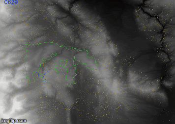
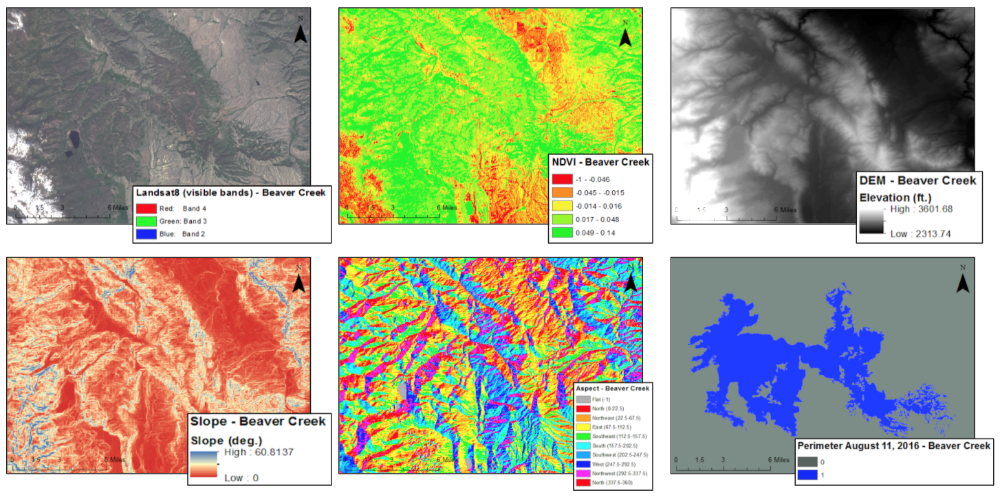
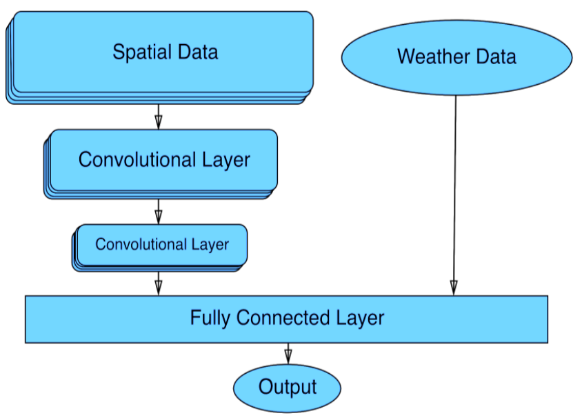

# Hot Topic

Use python satellite imagery, historical weather data, and historical fire perimeters to predict wildfire spreading using artificial neural network.

This was [Anna Hessler](https://github.com/annahessler),
[Dave Radke](https://github.com/Dtradke), and
[Nick Crews](https://github.com/NickCrews)'s 2018 senior project for the
Computer Science department at Colorado College. We presented this research to
members of congress at the 2018 [Posters on the Hill](https://www.cur.org/what/events/students/poh/) conference. To learn more about the project, you can

- Browse our [powerpoint presentation](https://docs.google.com/presentation/d/1b8Vq5Vs4pBj6efoVFWEm659koZugY1I3jloaSPSPRrs).
- Read our [paper](https://drive.google.com/drive/folders/0B3llCHJfA43FU0Y2WkxLMFpLdjg)

# Requirements

the following python3 libraries should be installed

- numpy
- opencv
- keras (with Tensorflow backend)
- scipy
- matplotlib (optional, for visualization)

# Data sources

- Historical weather data: [NOAA READY Archive](https://www.ready.noaa.gov/READYamet.php) for the HRRR (High Resolution Rapid Refresh) weather model. 3km, 1 hr resolution
- Historical fire perimeters: [GeoMAC Database](https://www.geomac.gov/), a conglomeration of daily fire perimeters from many different land management agencies. Perimeters are typically organized into burns, so you can follow the progress of a fire as it grows day to day.
- Historical satellite imagery:
  - landsat
  - ndvi
  - dem (digital elevation model)
